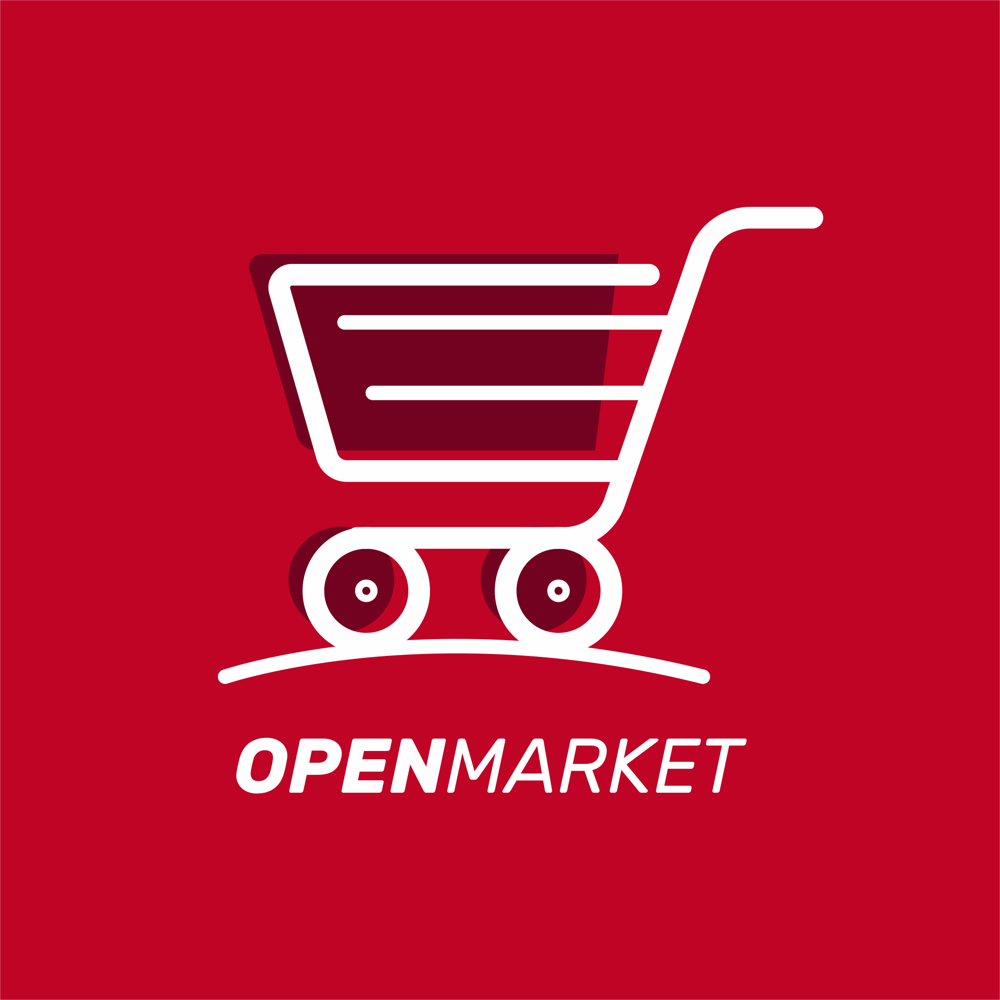

    
    <h1 >Assistente OpenMarket</h1>

# Como contribuir?

Este é um projeto totalmente livre que aceita contribuições via pull requests no GitHub. Este documento tem a responsabilidade de alinhar as contribuições de acordo com os padrões estabelecidos no mesmo. Em caso de dúvidas, [abra uma issue](https://github.com/vitorcesarlulio/open-market/issues).

## Primeiros passos

1. Fork este repositório.
2. Envie seus commits em português.
3. Solicite a pull request.
4. Insira um pequeno resumo dos links adicionados.